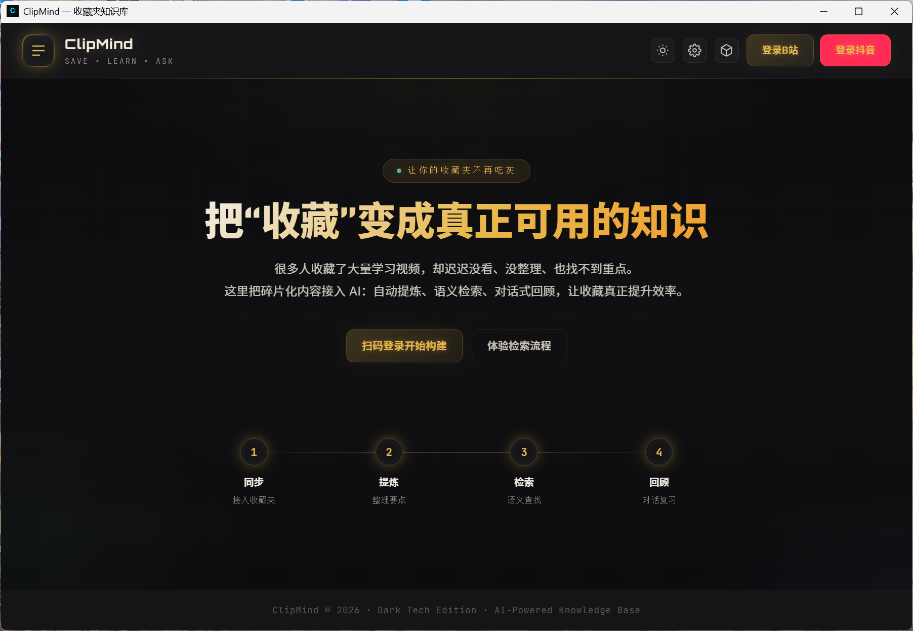
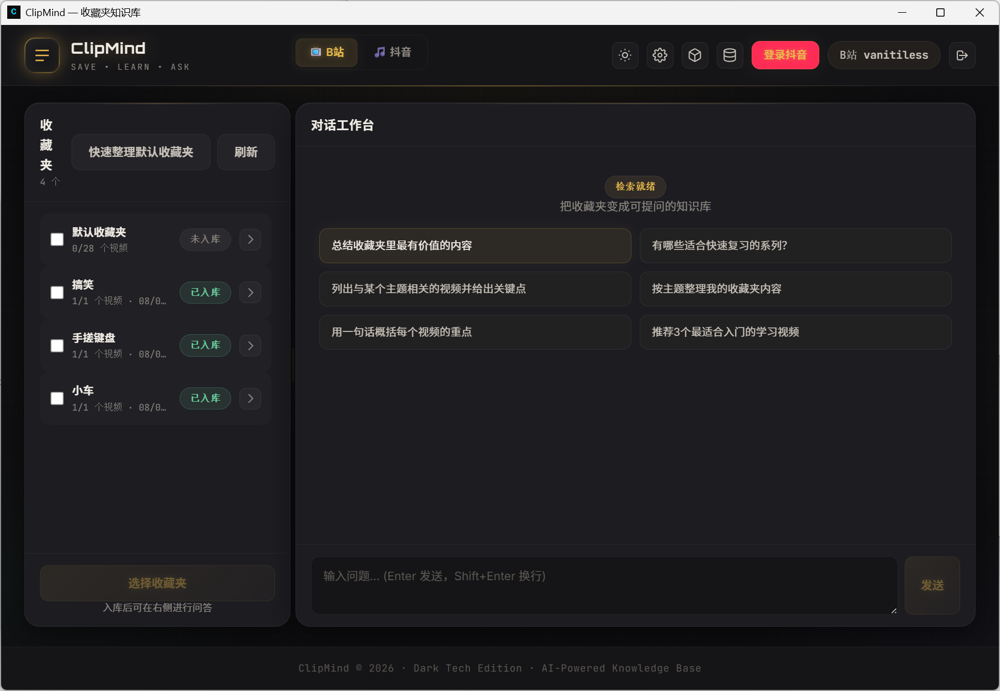
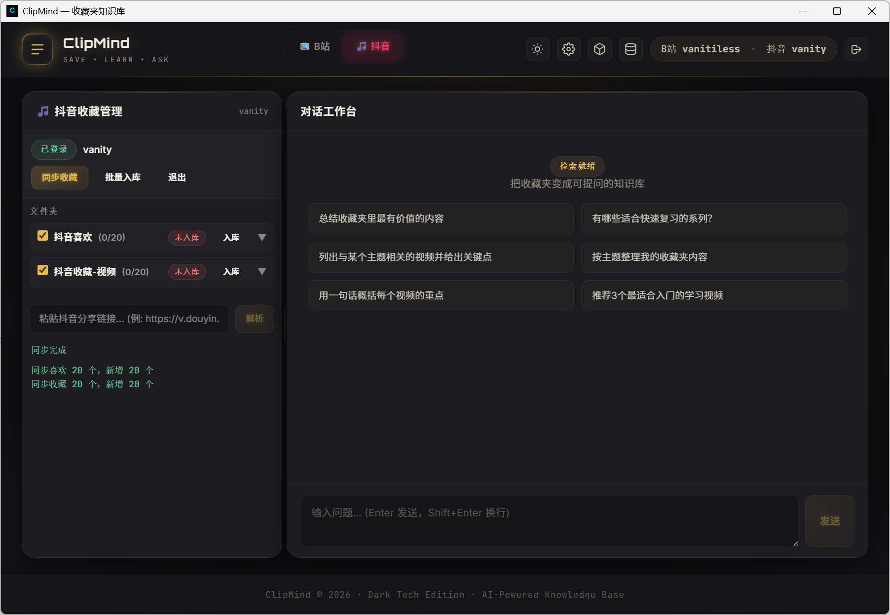
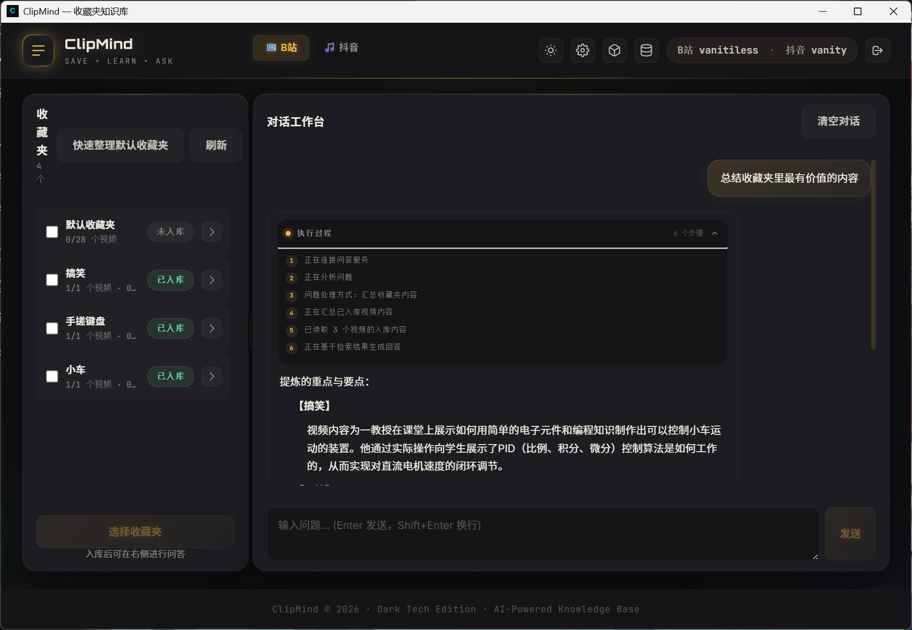
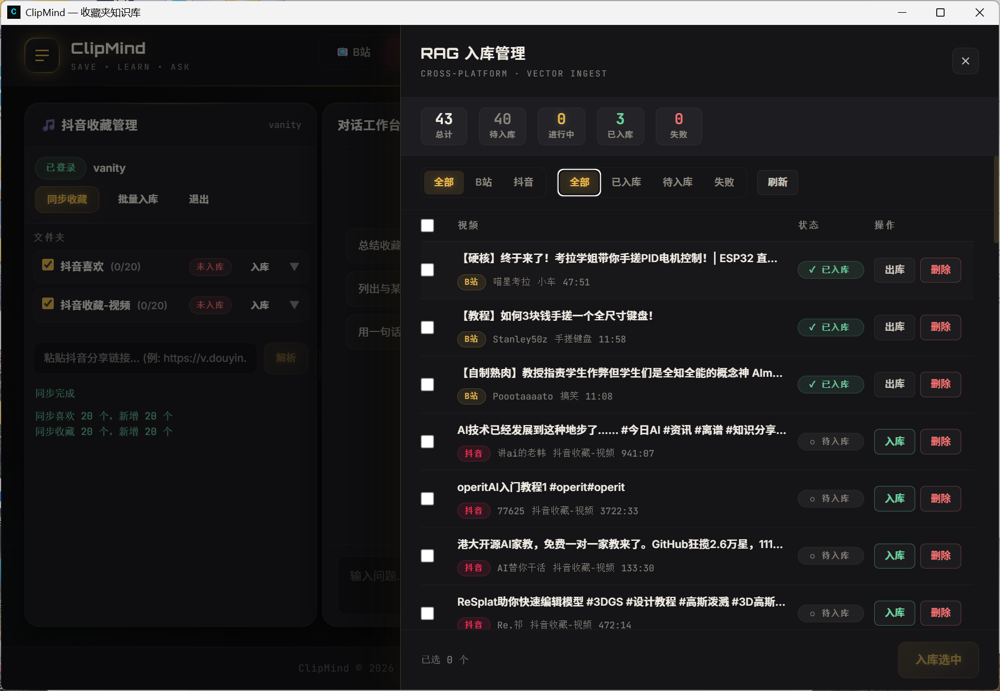
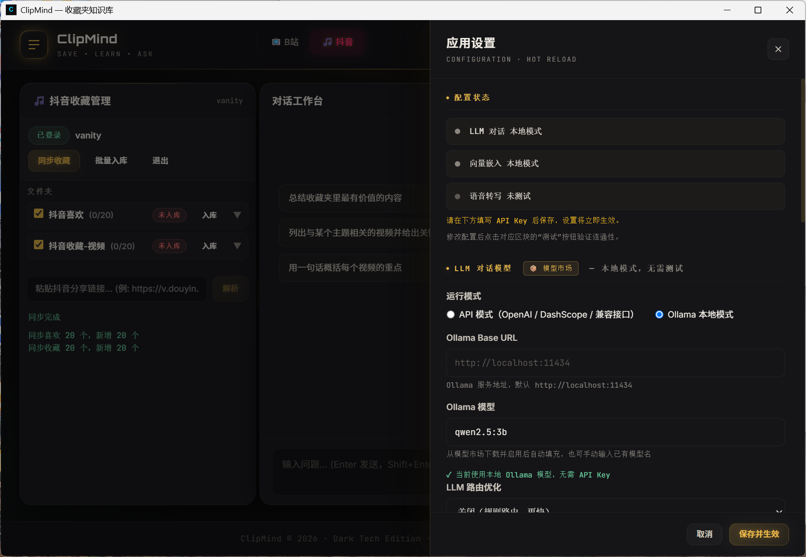
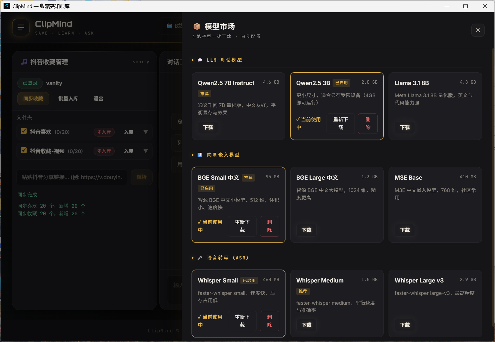

# ClipMind

> 把你在 B 站、抖音收藏的视频，变成可检索、可对话的个人知识库。

ClipMind 是一款本地优先的 AI 知识管理工具。它把你散落在抖音、B站的收藏视频自动抓取、转录、向量化，构建为可检索、可对话的私有知识库。所有数据存储在本地，LLM / Embedding / ASR 均支持 API 或本地模型双模式。

收藏是开始，学会才是目的——ClipMind 帮你把「收藏即吃灰」变成「收藏即学会」。

---

## 核心价值

很多人收藏了大量学习视频，却迟迟没看、没整理、也找不到重点。ClipMind 把碎片化内容接入 AI，形成一条完整链路：

```
同步收藏夹 → 语音转写 → 智能提炼 → 语义检索 → 对话回顾
```

- **同步**：接入你的 B站 / 抖音收藏夹
- **提炼**：自动转录视频内容、整理要点
- **检索**：语义搜索，找回任何看过/没看过的内容
- **回顾**：和你的知识库对话，AI 引用来源作答

---

## 界面总览

### 首页

未登录时展示产品引导页，一键扫码登录即可开始构建知识库；登录后进入工作区，左侧为收藏夹面板，右侧为 AI 对话面板，中间可拖拽调整宽度。



### B站面板

B站扫码登录后自动加载全部收藏夹，展开即可查看每个收藏夹的视频列表、逐条标记入库状态；选中收藏夹后一键「入库」，系统自动完成转录与向量化。



### 抖音面板

抖音扫码登录后同步「喜欢」与「收藏」，支持自定义获取上限；同步结果实时统计「已同步 / 新增」数量。



### RAG 对话面板

基于知识库的 AI 对话问答：混合检索（向量 + BM25）召回相关内容，LLM 生成回答并**逐条标注引用来源**，回答可追溯到具体视频与原文。



### 入库管理

集中查看所有视频的入库状态（已入库 / 待入库 / 失败），支持批量入库、失败重试、取消任务，实时查看进度。



### 应用设置

可视化配置 LLM / Embedding / ASR 三大模块，支持 API 与本地模型双模式切换，配置热加载即时生效，一键测试连通性。



### 模型市场

内置推荐模型目录：LLM（Ollama 量化模型）、向量模型（BGE 系列）、ASR（faster-whisper 全系），一键下载、自动配置、实时进度推送。



---

## 快速开始

### 方式一：桌面应用（推荐）

从 [Releases](../../releases/latest) 下载对应平台的安装包：

| 平台 | 安装包 |
|------|--------|
| Windows | `ClipMind_x64-setup.exe`（NSIS 安装包）或 `.msi` |
| macOS (Apple Silicon) | `ClipMind_aarch64.dmg` |
| Linux | `ClipMind_amd64.deb` |

安装后打开应用，扫码登录平台账号，即可开始使用。

### 方式二：Docker 部署

```bash
git clone https://github.com/Vanity-1/ClipMind.git
cd ClipMind
cp .env.example .env   # 按需编辑配置
docker compose up --build
```

部署后访问 `http://localhost:3000`，后端 API 在 `http://localhost:8000`。

### 方式三：源码运行

**前置要求**：Python 3.10+、Node.js 18+、ffmpeg（本地 ASR 需要，Windows 需将 bin 目录加入 PATH）

```bash
# 后端
cd clipmind
pip install -r requirements.txt
playwright install chromium
cp .env.example .env
python run.py

# 前端（另开终端）
cd clipmind/frontend
npm install
npm run dev
```

- 前端页面：`http://localhost:3000`
- 后端 API 文档：`http://localhost:8000/docs`

---

## 使用流程

1. **登录**：在首页点击「登录B站」或「登录抖音」，使用 App 扫码授权
2. **同步收藏夹**：登录后收藏夹自动加载；抖音面板可手动触发同步，支持设置获取上限
3. **入库**：选中收藏夹（或单个视频）点击「入库」，系统自动转录 + 向量化，入库管理面板可查看进度
4. **对话**：在右侧对话面板提问，AI 基于知识库回答并标注来源
5. **导出**：将视频内容导出为 Markdown 笔记，沉淀为可复用的文档

### 跳转原视频

视频列表中的任意条目、以及对话回答中的引用来源，**按住 `Ctrl`（macOS 为 `Cmd`）+ 鼠标左键**，即可在系统默认浏览器中直接打开原视频页面。

---

## 配置说明

ClipMind 的三大 AI 模块均支持「云端 API」与「本地模型」两种模式，可通过设置面板或 `.env` 文件配置。

### LLM（对话模型）

| 模式 | 说明 | 配置项 |
|------|------|--------|
| API | OpenAI 兼容接口（OpenAI / DashScope / 第三方） | `OPENAI_API_KEY`、`OPENAI_BASE_URL`、`LLM_MODEL` |
| 本地 | Ollama 本地模型 | `OLLAMA_BASE_URL`、`OLLAMA_MODEL` |

### Embedding（向量嵌入）

| 模式 | 说明 | 配置项 |
|------|------|--------|
| API | OpenAI / DashScope / NVIDIA 等 | `EMBEDDING_API_KEY`、`EMBEDDING_MODEL` |
| 本地 | BGE / M3E 等模型，通过模型市场下载 | `EMBEDDING_PROVIDER=local` |

> 本地 Embedding 使用 ONNX Runtime 推理，安装包无需携带 PyTorch，体积小、速度快。

### ASR（语音转写）

| 模式 | 说明 | 配置项 |
|------|------|--------|
| API | DashScope 云端转写 | `ASR_API_KEY`、`ASR_MODEL` |
| 本地 | faster-whisper（tiny / base / small / medium / large-v3） | `ASR_PROVIDER=local`、`ASR_MODEL_LOCAL` |

> 本地 ASR 无需 API Key，首次使用自动从 HuggingFace 下载模型（支持镜像加速）。

---

## 技术架构

```
视频平台 API → 内容抓取 → ASR 语音转写 → 文本分块 → 向量嵌入 → ChromaDB
                                                              ↓
用户提问 → 混合检索（向量 + BM25） → RRF 融合 → LLM 生成回答 → 来源追溯
```

| 层级 | 技术 |
|------|------|
| 前端 | Next.js 16 + React 19 + Tailwind CSS |
| 桌面端 | Tauri 2（Rust） |
| 后端 | FastAPI + Uvicorn（Python 3.11） |
| 向量库 | ChromaDB 0.5（混合检索 + RRF 融合） |
| LLM 框架 | LangChain 0.3 |
| ASR | DashScope / faster-whisper（本地） |
| 数据库 | SQLite（aiosqlite） |
| 浏览器自动化 | Playwright（扫码登录 + 内容抓取） |

---

## 数据与隐私

- 所有数据（数据库、向量、模型、日志）默认存储在本地 `data/` 目录
- 桌面端数据写入系统用户目录（`%APPDATA%/ClipMind`），保证可写
- Cookie 等敏感字段支持加密存储（配置 `COOKIE_ENCRYPTION_KEY`）
- 模型文件集中管理，多实例共用避免重复下载

---

## 开发与贡献

```bash
# 后端测试
pytest

# 前端
cd frontend
npm run dev    # 开发
npm run build  # 生产构建
npm run lint   # 代码检查

# 桌面端打包（需先构建前端与后端）
cd src-tauri
cargo tauri build
```

欢迎提交 Issue 与 PR。项目遵循 [MIT License](LICENSE)。
